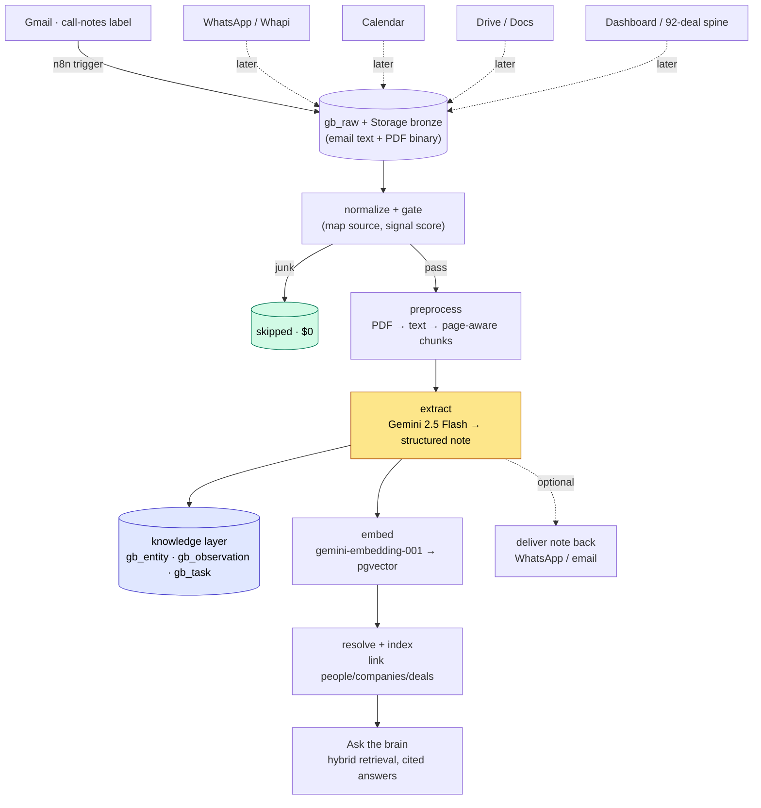

# gbrain — Master Plan & Milestones

> [!abstract] What this note is
> The single source of truth for **how gbrain gets built**, reflecting every decision locked so far. It supersedes the earlier draft plan where they differ (notably: analysis runs on **Gemini**, not Haiku; Supabase is **database-only**). Read this top-to-bottom for full clarity on the stack, the flow, and the order of work.

---

## 1. Where we are right now

> [!success] Done — Milestone 0 (Foundation)
> - Supabase project live, all three migrations applied (`001` schema · `002` queues · `003` knowledge layer) → **13 tables, 9 views, 7 queues**, RLS locked, auto-RLS on.
> - Workers deployed on the Hostinger VPS, running under systemd (`gbrain-normalize`, `gbrain-sweeper`).
> - **Gate 0 passed** — `test_dedup` green: native-id dedup, cross-channel dedup, replay-is-noop, and the signal gate (queues deal content, skips junk) all proven against live Supabase.

> [!info] In progress — Milestone 1 (Gmail call notes → structured notes)
> - Gmail call-notes **receiver** built (n8n trigger → `gb_raw`), `call-notes` always-extract routing wired.
> - **Next to build:** PDF attachment handling, the preprocess worker, and the Gemini extract worker.

---

## 2. The locked stack

| Layer | Choice | Why |
|---|---|---|
| **Database** | Supabase — Postgres, pgvector, pgmq, Storage | One managed box for store + queue + vectors + files. Database **only** — no Edge Functions, no pg_cron logic. |
| **Bronze file store** | Supabase Storage bucket `gbrain-bronze` (private) | Raw PDFs/decks kept once, hash-deduped, system-of-record. |
| **Orchestration (edges)** | n8n (on the VPS, Docker) | Triggers, webhooks, pollers, delivery. Already running 100+ workflows. |
| **Processing (loops)** | Python workers (on the VPS, systemd) | normalize, preprocess, extract, embed, resolve, index. Stateless, idempotent, queue-driven. |
| **Analysis / extraction** | **Gemini 2.5 Flash** (Vertex) — workhorse; escalate to Gemini 3 Flash / 2.5 Pro for dense CIMs | Your existing Notes-Agent pattern, ~free against Vertex credits. _(Gemini 2.0 Flash is shut down — migrate anything still on it.)_ |
| **Embeddings** | `gemini-embedding-001` (Vertex), MRL-truncated to **768** | Best-in-class retrieval, ~free against credits; 768 keeps the HNSW index lean. |
| **Host** | Hostinger KVM 4 VPS, Mumbai (4 vCPU / 16 GB) | Co-located with n8n. Root, IPv4+IPv6. |
| **Secrets** | `.env` on the VPS (chmod 600), one per service | DB string, Vertex creds. |

> [!key] The cost thesis still holds
> LLM analysis is ~95% of variable cost. The levers are unchanged, just on Gemini: **gate** before spending (dedup + signal score), **batch** ingestion (no human waiting), **cache** the constant prompt prefix, **cascade** (Flash by default, escalate only on hard docs). At Dexter's volume, against Vertex credits, variable cost lands near **$0**.

---

## 3. How it flows, end to end

A call-note email with a deck attached is the canonical case. Here's its journey:



**In words:**
1. n8n catches the email, lands the text in `gb_raw`, downloads each PDF to `gbrain-bronze`, and lands the PDF as its own item (hash recorded for dedup).
2. **normalize** maps it to a canonical envelope and scores it — `call-notes` → always extract.
3. **preprocess** pulls the text out of the PDF (free, local) and chunks it page-aware.
4. **extract** sends the text to Gemini with your analysis prompt → a structured note (company, sector, stage, ask, valuation, metrics, founders, summary, risks).
5. That note is **stored three ways**: as JSON on the envelope, fanned out into the knowledge layer (`gb_entity` company/person/deal, `gb_observation` financials), and embedded into pgvector.
6. The raw PDF stays in bronze forever as the record of truth.
7. _(Optional)_ the finished note is pushed back to you on WhatsApp/email, like the Notes Agent does today.
8. The same deck arriving later over WhatsApp collides on its hash → **extracted once, not twice.**

---

## 4. The processing spine (built once, reused by every source)

The workers don't care which source an item came from — that's the whole point of the canonical envelope. Build the spine for Gmail call notes in M1, and WhatsApp/Calendar/Drive in later milestones just plug into it.

| Stage | Worker / tool | Queue in → out | Cost |
|---|---|---|---|
| Intake | n8n connector | — → `gb_q_normalize` | $0 |
| Normalize + gate | `normalize.py` | `gb_q_normalize` → `gb_q_preprocess` | $0 |
| Preprocess | `preprocess.py` | `gb_q_preprocess` → `gb_q_extract` | $0 (local PDF text) |
| **Extract** | `extract.py` (Gemini) | `gb_q_extract` → `gb_q_embed` | **the one paid step** |
| Embed | `embed.py` (Gemini) | `gb_q_embed` → `gb_q_resolve` | ~$0 (credits) |
| Resolve + index | `resolve.py` / `index.py` | `gb_q_resolve` → `gb_q_index` → done | $0 |

> [!note] Discipline that doesn't bend
> Connectors stay **dumb** (land + enqueue, no LLM). All spend happens behind the gate. Workers are **idempotent** (re-check status; a redelivered message is a no-op). The queue guarantees delivery; `status` is the queryable truth.

---

## 5. Milestones

Each milestone is independently shippable and "done" only when its **gate** passes — not when code is written.

### ✅ M0 — Foundation _(DONE)_
Schema, queues, normalize + gate, workers on the VPS, dedup proven.
**Gate:** `test_dedup` green. ✔

### ▶ M1 — Gmail call notes → structured notes _(in progress — the proof)_
Build the **entire processing spine** using call notes as the first real source.
- Gmail connector: email **+ PDF attachments** → `gb_raw` + `gbrain-bronze`.
- `preprocess`: PDF → text → page-aware chunks.
- `extract`: Gemini 2.5 Flash → your structured note → `gb_entity` / `gb_observation`.
- `embed`: gemini-embedding-001 → pgvector.
- _(optional)_ deliver the note back to you.

**Gate M1:** a real call-note email with a deck produces a complete structured note end-to-end, the raw PDF is in bronze, the note is queryable, and the cost is logged. The same deck sent twice extracts once.

### M2 — WhatsApp decks
Whapi receiver → the **same spine**. Run the existing Notes Agent **in parallel**; retire its extraction only after a 10-deck parity check.
**Gate M2:** a deck via WhatsApp produces the same quality note as M1; a deck via both email and WhatsApp extracts once.

### M3 — Calendar + Drive + the deal spine
Calendar (structured, no LLM — links people↔companies↔deals), Drive/Docs (content-hash gate, ACLs), and load the **92-deal dataset** as the canonical entity spine.
**Gate M3:** calendar events create entities/edges at $0; a Drive permission change does **not** re-run the LLM; mentions resolve against the 92-deal spine.

### M4 — Identity resolution + graph
Deterministic joins (phone↔email↔attendee↔author; domain↔company; mention↔deal), Postgres edge tables, Gemini only on the residual.
**Gate M4:** ≥90% of links resolved deterministically; a temporal query ("Acme calls in Q2") returns.

### M5 — Ask the brain
Hybrid retrieval (FTS + pgvector + graph), permission-filtered, cited answers; governance (DPDP, ACL, delete-propagation); budget caps + kill switches.
**Gate M5:** a restricted doc never surfaces to an unauthorized query; deletion propagates; a runaway backfill self-pauses at the cap.

---

## 6. Source rollout order

```
Gmail call notes (+PDF)  →  WhatsApp decks  →  Calendar  →  Drive/Docs  →  Dashboard spine
      M1                        M2              M3           M3              M3
```
Gmail first because it's the highest-signal stream (always-extract), plain text + native PDFs (no OCR), and where the Dexter brain originally lived. Every later source reuses the M1 spine.

---

## 7. Where everything lives

```
Supabase (cloud, Mumbai)              Hostinger VPS (Mumbai, srv957712)
├─ Postgres: gb_* tables, views        ├─ n8n (Docker) — connectors, delivery
├─ pgvector: gb_chunk.embedding        ├─ /opt/gbrain  — the repo
├─ pgmq: gb_q_* queues                 │   ├─ workers/ (systemd services)
└─ Storage: gbrain-bronze (PDFs)       │   ├─ .env (DB string, Vertex creds)
                                       │   └─ sql/ n8n/ ops/
        ▲                              └─ Gemini calls → Vertex AI (credits)
        └──────── workers + n8n connect over the network ───────┘
```

---

## 8. Build checklist (live)

- [x] **M0** schema + queues + normalize + workers + dedup test
- [ ] **M1.1** create `gbrain-bronze` Storage bucket
- [ ] **M1.2** Gmail connector extended for PDF attachments (download → bronze → land)
- [ ] **M1.3** `preprocess.py` — PDF text extraction + page-aware chunking
- [ ] **M1.4** `extract.py` — Gemini analysis → structured note + entities + observations
- [ ] **M1.5** `embed.py` — gemini-embedding-001 → pgvector
- [ ] **M1.6** _(optional)_ deliver note back to WhatsApp/email
- [ ] **M1 gate** — full call-note-with-deck → note, end to end
- [ ] **M2** WhatsApp + Notes-Agent parity + retire
- [ ] **M3** Calendar + Drive + 92-deal spine
- [ ] **M4** identity + graph
- [ ] **M5** retrieval + governance

---

## 9. Open decisions (resolve to keep moving)

> [!question] Needed for M1
> 1. **Analysis prompt / note schema** — share your existing Notes-Agent Gemini prompt (so `extract.py` produces your exact note format), or I build from a strong default VC/IB deck schema and you refine.
> 2. **OCR scope** — are call-note decks native PDFs (free text extraction) or sometimes scanned (need Tesseract/OCR)? Build native-first unless you say otherwise.
> 3. **Deliver-back** — do you want finished notes pushed to WhatsApp/email (like the Notes Agent), or just stored and queryable for now?
> 4. **Notes-Agent health** — is your current agent on `gemini-2.0-flash`? If so it likely broke June 1; migrate it to `gemini-2.5-flash`.

---

## Related notes
- [[gbrain - Cost-Optimized Ingestion Pipeline]] · [[gbrain - Processing Pipeline & Data Ingestion Plan]]
- [[Dexter Venture Notes]] — the workflow this absorbs · [[92-Deal Dataset]] — the identity spine
- [[Supabase]] · [[Whapi]] · [[pgmq]] · [[n8n Workflows]]
